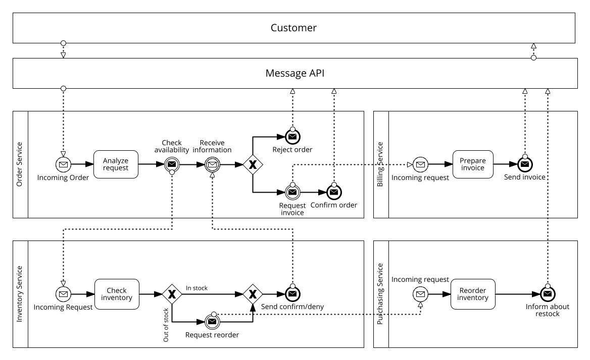
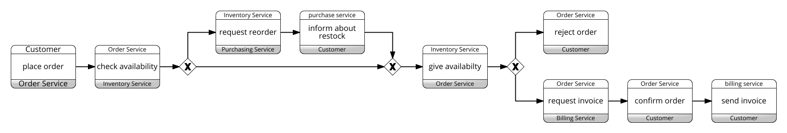

<div align="center">

# Profile Based Anomaly Detection in Service Oriented Business Processes

[](https://github.com/pre-commit/pre-commit)
<a href="https://pytorch.org/get-started/locally/"></a>
<a href="https://pytorchlightning.ai/"></a>
<a href="https://hydra.cc/"></a>
<a href="https://github.com/ashleve/lightning-hydra-template"></a><br>

</div>

## Description

Repository to supporting CoopIS submission.

<div align="center">

### Abstract
<br>
Business process anomaly detection enables the prevention of misuse and failures. Existing approaches focus on detecting anomalies in control, temporal, and resource behavior of individual instances, neglecting the data flow, collaborations, and choreographies involving multiple instances. Consequently, anomaly detection capabilities are limited, as culprits can strategically split their actions across multiple instances to evade detection. This study presents a novel neural network-based approach to detect anomalies in distributed business processes. Unlike existing methods, our solution considers message data exchanged during process interactions. Allowing the generation of detection profiles incorporating the relationship between multiple instances, related services, and exchanged data to detect point and contextual anomalies during process runtime, thus reducing the likelihood of anomalies going unnoticed. To validate the proposed solution, it is demonstrated on a publicly available prototype implementation of a distributed system as well as real-life and artificial execution logs with injected artifical anomalies.
</div>

## How to run

### Basics and Dependency Installation:

```bash
# clone project
git clone https://github.com/nico-ru/profile-based-anomaly-detection
cd profile-based-anomaly-detection

# [OPTIONAL] create conda environment
conda create -n <myenv> python=3.10
conda activate <myenv>

# install pytorch according to instructions
# https://pytorch.org/get-started/
# install requirements
pip install -r requirements.txt
```

Train model with default configuration

```bash
# train on CPU
python src/train.py trainer=cpu
# train on GPU
python src/train.py trainer=gpu
```

Train model with chosen experiment configuration from [config/experiment/](config/experiment/)

```bash
python src/train.py experiment=<experiment>.yaml
```

You can override any parameter from command line like this

```bash
python src/train.py experiment=<experiment>.yaml trainer.max_epochs=20 
```

### Run example experiment:
Extract example data set
```bash
tar -xzvf simulation/example_dataset -C data/
```

```bash
python src/train.py experiment=example.yaml
```

```bash
python src/eval.py experiment=example.yaml ckpt_path=<last/checkpoint/path>
```

The example experiment relies on an exemplary data set previously generated by the process simulation also provided in this repository.<br>
This simulation environment can be viewed as a separate project included into this repositry and lives under `/simulation`.<br>
The discription of the simulation environment can be found in the following or `/simulation/README.md`.<br><br>

# Process Simulation
## Description

The simulated system aims to mimic a webshop system consisting of individual services. Each service is responsible for a specific domain in the ordering process.  
Purpose is to generate a log of the underlying workflow of the system. This log containing the data transferred in the communication between services. Following figure illustrates the implemented system:


 
 Given this system, an order results in the following process choreography:
 

## Quickstart
### setup the project
```bash
# clone project
git clone https://github.com/nico-ru/so-process-simulation.git
cd so-process-simulation

# [OPTIONAL] create conda environment
conda create -n myenv python=3.10
conda activate myenv

# [OPTIONAL] install graphviz executables
# https://graphviz.org/download/

# install requirements
pip install -r requirements.txt

# setup and install package
python setup.py install
pip install .

# setup .env file according to env.example
cp env.example .env
sed -i "s|<base_dir>|$(pwd)|" .env   # note: if there is a | character in your path chage the delimiter

# or edit with your preferred editor
vim .env # --> edit path variable
```

### run the simulation
```bash
# start the services
/bin/bash scripts/start_services.sh

# start simulation
python run_simulation.py --n_requests 100

# wait until all processes have stopped
# server logs can be observed with
tail -f logs/server/*.log
```

## Logs
The logs of the system are saved individually for each of the services. This includes the process event log in a csv format as well as the corresponding messages transferred between services. In order to merge the logs of the process choreography use:

```bash
python merge_logs.py
```

### Service Compounds
In case only the communication bewteen a certain subset of services (i.e. service compound) needs to be analyzed, the logs of only these can be merged as follows:
```bash
# merge only order and inventory logs
python merge_logs.py --services order inventory

# results will be in logs/compound/
```

### Export with messages
```bash
python export_logs.py

# export for only order and inventory services
python merge_logs.py --services order inventory

# results will be in result/
```


